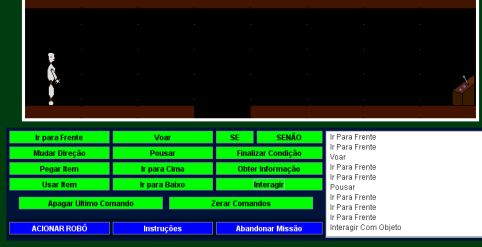

## Hello \o

## I'm Cleyton Dim, and this is my Portfolio Page

Here I will be showing some activities and projects that I participated in, in descending temporal order.

____________________________________________________________________________________________________________

### SIGAA

SIGAA is an integrated academic management system used in several universities. My main role is in the development of new features in the system at one of the universities.
____________________________________________________________________________________________________________

### HORNCHECK

Horncheck is a prototype car horn detector, developed as one of the steps in the investigation of machine learning models for the conclusion of my Ph.D.
For more details see [Google Play Link](https://play.google.com/store/apps/details?id=com.dimsoluts.horncheck).
____________________________________________________________________________________________________________

### P-ZERO: ESCAPE

P-Zero: Escape was a game developed for android purely in Java, with its own game engine built in java. It is a 2D third person shooter game.
For more details see [Google Play Link](https://play.google.com/store/apps/details?id=dim.android.pzero).
____________________________________________________________________________________________________________

### APIN

APIN was an educational game for teaching logic programming, developed in Java Applets, where the user must build a block of commands, which will be executed to solve missions in the game. It was developed as part of my Master's thesis.

